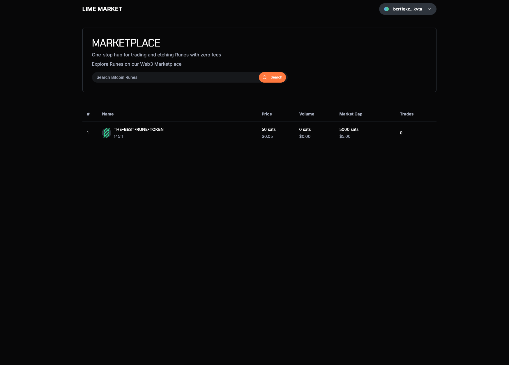
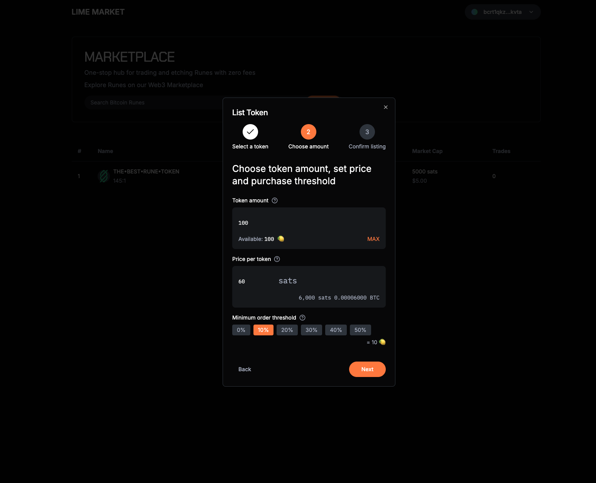
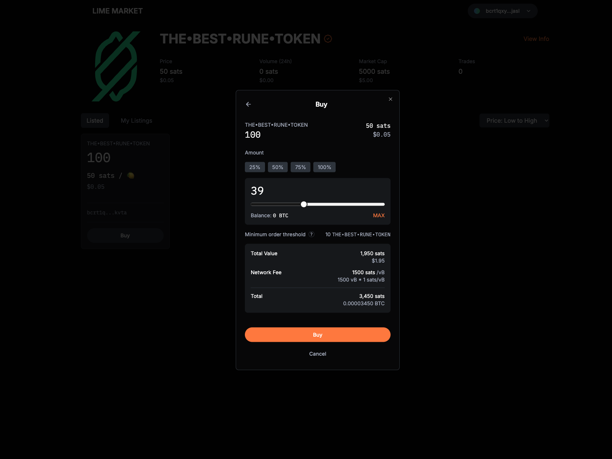

# Runes Marketplace using OP_CAT

Marketplace for trading Rune tokens using covenants to allow for partial filling of sell orders.

The specification is [here](./Efficient%20Runes%20Marketplace%20Specification.pdf)

## Requirements
- `node >=v22.13.0`
- `make`
- `jq`
- `docker`

## Build

### Create .env file
> [!TIP]
> You can use the `.env.example`

### Start the infrastructure
```bash
cd infrastructure
./setup_ord.sh && make keep-mining SEC=20
```

> [!WARNING]
> The script works on macOS. If you're using a different OS, change the `ord` directory in `setup_ord.sh` based on this [table](https://docs.ordinals.com/guides/reindexing.html)

### Compile the contracts

```bash
cd contracts
npx scrypt-cli@latest compile -i "src/contracts/sellOrder.ts" --asm
```

#### Test the contract

```bash
NETWORK=regtest npx mocha --no-config --require ts-node/register tests/sellOrder.test.ts
```

### Move contract to frontend

Contract files should be automatically linked in the frontend. If they aren't, copy `sellOrder.ts`, `sigHashUtils.ts` and `opmul.ts` from `contracts/src/contracts` and `sellOrder.json` from `contracts/artifacts` to `frontend/contracts`

### Run the backend

```bash
cd backend
npm run start
```

### Run the frontend

```bash
cd frontend
npm run dev
```

## Marketplace Implementation


Marketplace Homepage


Create Sell Order Dialog


Buy Listing Dialog